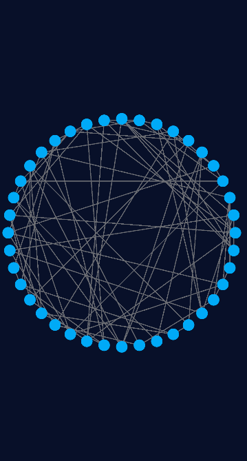
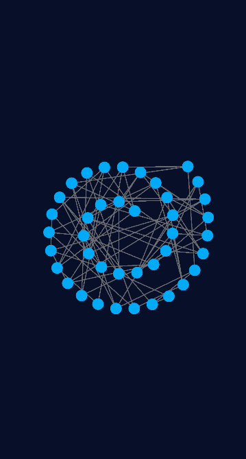
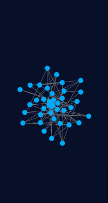

# Untangle Custom

#### 📃 ReadMe

Немного математики и алгоритмов под Android. 
- Интерфейс
 - ✅ Фрагменты через NavComponent
 - ✅ Сохранение стейта при перевороте через ViewModel
 - ✅ Разрешение поворота экрана на главном фрагменте и фрагменте опций, запрет на фрагменте игры
 - ✅ Рисование на канве через CustomSurfaceView
 - ✅ Автосохранение через JSON String в Storage (SharedPrefs)
- Архитектура
 - ✅ Архитектурный паттерн "не бей лежачего"
 - ✅ Шаблон проектирования MVVM (без энтузиазма), применение DI Koin
- Алгоритмы
 - Определение индекса круга при нажатии
  - ✅ Прямой перебор по координатам по списку
  - ⬜️ Оптимизация
 - Генерация графа
  - ✅ Неслучайная генерация планарного графа без проверки на пересечение (без рандомной генерации граф не может быть не планарным)
  - ⬜️ Рандомизация ребер по количеству в нерандомном графе
  - ⬜️ Рандомная генерация ребер графа(по направлению и количеству)
 - Расстановка кружков на экране при New Game
  - ✅ По окружности
  - ✅ Испытания других фигур
  - ⬜️ Для большого количества кружков применять алгоритм квазислучайных последовательностей с низким расхождением (Соболь, Кронекер, Халтон...)
 - Проверка пересечений линий
  - ✅ Прямой перебор по координатам по списку
  - ⬜️ Оптимизация (проверять только изменяемые)
  - ⬜️ Опция Счетчик пересечений на экране
  - ⬜️ Опция подсвечивания пересекающихся/непересекающихся линий
 - Анимация при победе
  - ✅ Быстрый слив в центр
  - ⬜️ Оптимизация

#### 💻 Интерфейс

|**Начальный экран**|**Настройки игры**|**Новая игра**|
| :------------ | :------------ | :------------ |
||||
|**Автосохранение и возврат**|**Победа**||
||||

Сложность уровня задается при создании новой игры. После сворачивания приложения прогресс сохраняется автоматически.

> Без ограничений по времени, без переходов с уровня на уровень, без торнаментов и сравнений результатов игроков. Настрой свой уровень игры сам!

#### 📊 Генерация графа
Работающий способ генерации планарного графа без рандомизации ребер.
- Создается список с индексами точек, количество точек задается при старте игры
- Список перемешивается
- Создается двухмерный массив чисел
- По этому массиву раскладываются индексы точек поочередно
- Точки соединяются по правилу вправо, вниз, влево-вниз с проверкой на максимальное количество связей для каждой точки (задается в начале игры)

#### Способы расстановки кружков
|**По кругу**|**По спирали**|**Вихрь**|
| :------------ | :------------ | :------------ |
||||

