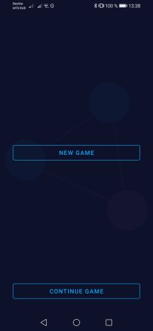
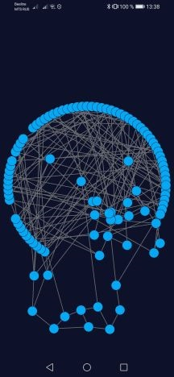
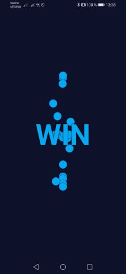

# Untangle Custom

[TOC]

#### ReadMe

Немного математики и алгоритмов под Android. Создавалась исключительно для отвлечения от насущных проблем в процессе создания, так и в игре. По плану придерживаться следующей дорожной карты:
- Интерфейс
 - ✅ Фрагменты через NavComponent
 - ✅ Сохранение стейта при перевороте через ViewModel
 - ✅ Разрешение поворота экрана на главном фрагменте и фрагменте опций, запрет на фрагменте игры
 - ✅ Рисование на канве через CustomSurfaceView
- Архитектура
  - ✅ Архитектурный паттерн "не бей лежачего"
  - ✅ Шаблон проектирования MVVM (без энтузиазма), применение DI Koin
- Алгоитмы
 - Определение индекса круга при нажатии
   - ✅ Прямой перебор по координатам по списку
   - ⬜️ Оптимизация
 - Генерация графа
   - ✅ Неслучайная генерация планарного графа без проверки на пересечение (без рандомной генерации граф не может быть не планарным)
   - ⬜️ Рандомная генерация ребер графа
 - Расстановка кружков на экране при New Game
   - ✅ По окружности
   - ✅ Испытания других фигур
   - ⬜️ Для большого количества кружков применять алгоритм квазислучайных последовательностей с низким расхождением (Соболь, Кронекер, Халтон...)
 - Проверка пересечений линий
   - ✅ Прямой перебор по координатам по списку
   - ⬜️ Оптимизация (проверять только изменяемые)
 - Анимация при победе
   - ✅ Быстрый слив в центр
   - ⬜️ Оптимизация

#### Интерфейс

#### Генерация графа
Работающий способ генерации планарного графа без рандомизации ребер.
 - Создается список с индексами точек, количество точек задается при старте игры
 - Список перемешивается
 - Создается двухмерный массив чисел
 - По этому массиву раскладываются индексы точек поочередно
 - Точки соединяются по правилу вправо, вниз, влево-вниз с проверкой на максимальное количество связей для каждой точки (задается в начале игры)